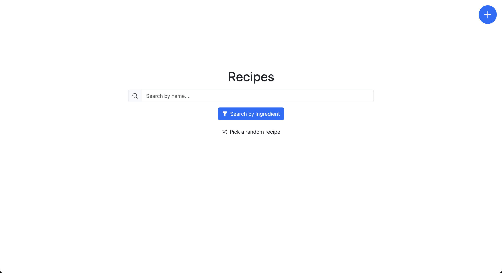
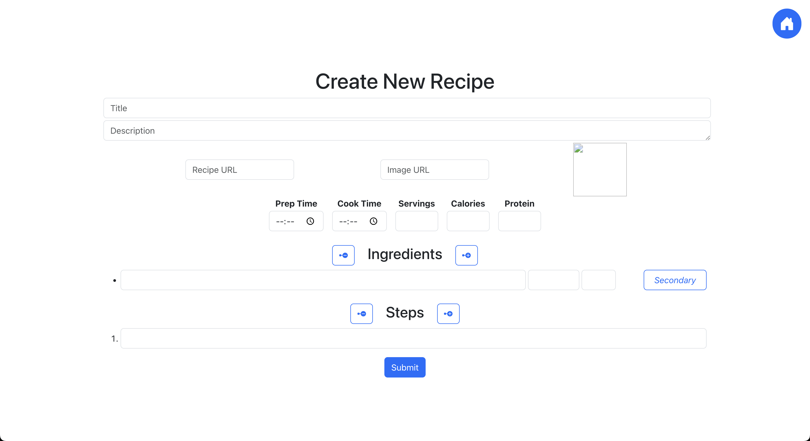
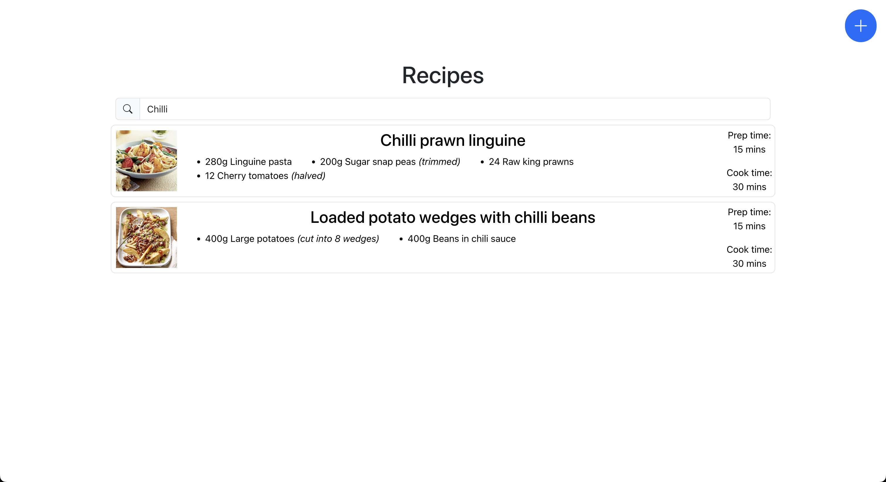
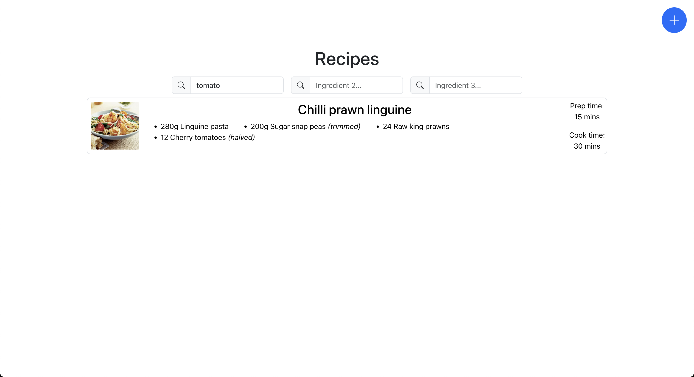
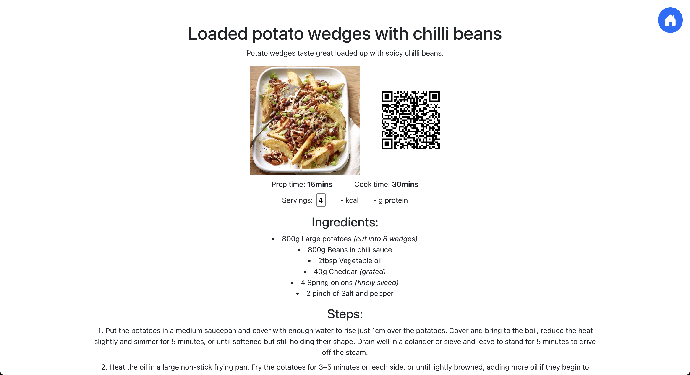
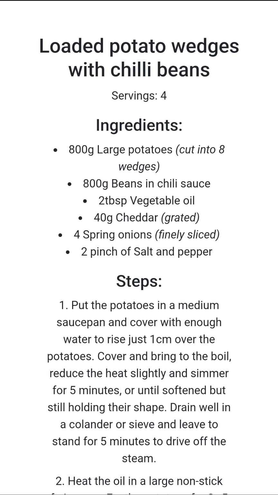

# Recipes App

Save your favourite recipes in a digital recipe book all of your own.

This app is intended to help you find your favourite past recipes. If you are running
low on inspiration, or you have ingredients that you're not sure what to do with,
or even if you just want to remake some of your favourite past recipes, you can use this
app to find something for you.

The app is initially intended for browsing on a desktop, laptop or other large screen, then 
later viewing the recipe on mobile, with a simple interface to allow for easy recipe reading.

## Table of contents

1. [How it works](#how-it-works)
    - [Create a new recipe](#create-a-new-recipe)
    - [Search by name](#search-by-name)
    - [Search by ingredient](#search-by-ingredient)
    - [Viewing a recipe](#viewing-a-recipe)
        - [Desktop view](#desktop-view)
        - [Mobile view](#mobile-view)
2. [Setup your database](#setup-your-database)
    - [Using firebase](#using-firebase-recommended)
    - [Using an alternative database](#using-an-alternative-database)
3. [Run the app](#run-the-app)
    - [Using startup script](#using-startup-script)
    - [Custom run](#custom-run)
4. [Modify the app](#modify-the-app)

## How it works

On first load, you will be shown a start screen with multiple options:
- Create a new recipe
- Search by name
- Search by ingredient
- Pick a random recipe

### Create a new recipe

When you first load the app, you will not have any recipes stored in the database.
This is your recipe book, so feel free to fill it up with recipes you love!

If you press the `+` button in the top-right of the home screen, you will find the
page to create new recipes.

Here, you can enter all the information needed to recreate the recipe. 

The amount entered for the ingredients should match the amount of servings that the
recipe will create. The app will adjust these values if you later wish to make the same
recipe but with more (or less) servings, so we want these values to be accurate!

Similarly, it is not recommended to include ingredient amounts within the steps, since
you may have more or less of an ingredient if you're making a different serving size.
Instead, it would be preferred to reference proportional values. 

For example: `Add the flour...` or `Add half of the flour...` will be easier to 
understand than `Add 250g of flour...`.

### Search by name

If you know the name of the recipe you want to recreate, this is the search box for you.

Any recipe that includes your input will appear in this list.

### Search by ingredient

On the other hand, perhaps you have some ingredients that need using up and you're not 
sure what to cook?

In this case, you can enter up to three ingredients in this search entry.

This search will match all recipes with any ingredient that includes your search. You do 
not need to exactly match the ingredient - for example `Pepper` might match `Bell Pepper` 
or `Chilli Pepper`. 

Recipes will be ordered from the first ingredient to the last ingredient. So put the 
ingredients you most want to use first, to ensure the recipes including those ingredients
will appear sooner.

### Viewing a recipe

#### Desktop view

When you first click a recipe for viewing (i.e from a search result, or from clicking a 
random recipe), you will enter the desktop view for the recipe. 

This view contains all information about the recipe and is intended for you to take a look 
and see if that is the recipe that you want to make. 

You might want to change the serving size of the recipe, in which case the ingredients will
be altered accordingly to match the correct amount of the recipe that you want to make.

This view can be used on any device, but is recommended for display on a relatively large 
screen, for ease of viewing.

#### Mobile view

Once you have decided which recipe you want to make, you might want to see that recipe on
your mobile device, as you can take it into the kitchen with you.

In which case, simply scan the QR code on the desktop view for the recipe and the recipe 
will load up on your phone. This view is simpler, in order to refine what is needed for
making the recipe. You will see only the name, ingredients and steps required to make the
recipe - other information is hidden away.

The serving count entered on the desktop view will also carry over to the mobile view.

## Setup your database

For cost, simplicity and privacy reasons, this app does not come setup with a functional
database on first launch. As a result, you will be unable to create or view any recipes 
until you have set one up.

### Using firebase (recommended)

This app is fully setup to support a [firebase](https://firebase.google.com/) database.

In order to use a firebase database, you will need to setup a new firebase project & 
application, then simply add the application details into service, and it will all be 
hooked up.

For a full set of instructions, see [FirebaseConfig-example.ts](./src/service/FirebaseConfig-example.ts).

### Using an alternative database

In order to use an alternative database, you will need to setup the database, provide the
service to access the data, and hook it into the UI.

This is up to you to decide how to implement, but you may wish to take a look at 
[FirebaseService.ts](./src/service/FirebaseService.ts) for a firebase-specific example.

See [Modify the app](#modify-the-app) for more information.

## Run the app

### Using startup script

This is the easiest method of running the app. 
Simply run `npm run startup` from a terminal and the app will be run for you.

Note: this will only work with a firebase database setup and may not work on windows systems.

### Custom run

If the above script does not work, or you have implemented a custom database provider,
you may need to run the app on your own.

On first use, run `npm i && npm run build`. This will build the application for you.
Next, and on all future uses, run `npm run serve`. 
This will run the app and open the browser for you.

## Modify the app

This app is free to use and modify how you wish!

If you wish to add your own modifications, you may fork the repository or create your own branch. 
Pull requests will not be accepted on the original repository.

In order to run the app in dev mode, simply run `npm run start`.

The app was made using Bootstrap and includes Bootstrap icons, which you may choose to take 
advantage of.

Prettier and some ESLint packages come pre-installed.

Once your modifications are complete, you can use the [custom run script](#custom-run), or even the 
[startup script](#using-startup-script) if you are still using Firebase.
